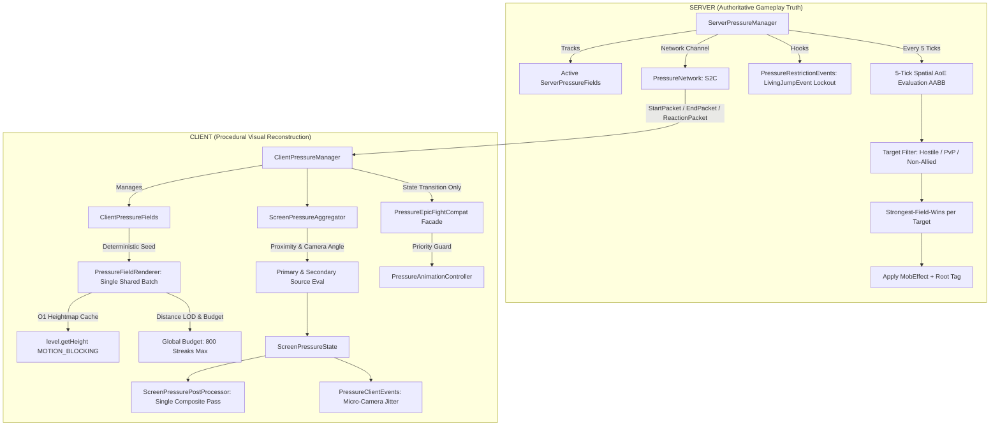

# แผนแม่บทและสถาปัตยกรรมระบบแรงดันวิญญาณ (Spiritual Pressure / Reiatsu Field System)

เอกสารนี้รวบรวมแผนแม่บท สเปกระบบ สถาปัตยกรรมทางเทคนิค แบบจำลองข้อมูล โปรโตคอลเครือข่าย ไปป์ไลน์การเรนเดอร์ และแนวทางการพัฒนาทั้งหมดของระบบ **Spiritual Pressure / Reiatsu Field System** สำหรับ Minecraft Forge 1.20.1 ภายในม็อด `BHSpells (bhspells)` ซึ่งผสานการทำงานร่วมกับ **Iron’s Spells ‘n Spellbooks** และ **Epic Fight**

---

## สารบัญ (Table of Contents)

1. [บทนำและความเป็นมา (Introduction & Concept)](#1-บทนำและความเป็นมา-introduction--concept)
2. [ปรัชญาการออกแบบหลัก (Core Design Principles)](#2-ปรัชญาการออกแบบหลัก-core-design-principles)
3. [ข้อห้ามและปัญหาด้านประสิทธิภาพที่ต้องหลีกเลี่ยง (Anti-Patterns & Prohibitions)](#3-ข้อห้ามและปัญหาด้านประสิทธิภาพที่ต้องหลีกเลี่ยง-anti-patterns--prohibitions)
4. [เกณฑ์การยอมรับของระบบ 23 ข้อ (Acceptance Criteria)](#4-เกณฑ์การยอมรับของระบบ-23-ข้อ-acceptance-criteria)
5. [แผนผังโครงสร้างสถาปัตยกรรม (System Architecture Diagram)](#5-แผนผังโครงสร้างสถาปัตยกรรม-system-architecture-diagram)
6. [แบบจำลองข้อมูลและสัญญาข้อมูล (Data Model & Contracts)](#6-แบบจำลองข้อมูลและสัญญาข้อมูล-data-model--contracts)
7. [ระบบเครือข่ายและโปรโตคอล (Network Protocol & Packets)](#7-ระบบเครือข่ายและโปรโตคอล-network-protocol--packets)
8. [ระบบการเรนเดอร์ในโลก (World-Space Visual Streak System)](#8-ระบบการเรนเดอร์ในโลก-world-space-visual-streak-system)
9. [ระบบเอฟเฟกต์บนหน้าจอ (Screen Pressure & Post-Processing Pipeline)](#9-ระบบเอฟเฟกต์บนหน้าจอ-screen-pressure--post-processing-pipeline)
10. [ตรรกะฝั่งเซิร์ฟเวอร์และการควบคุมเกมเพลย์ (Server Gameplay Truth)](#10-ตรรกะฝั่งเซิร์ฟเวอร์และการควบคุมเกมเพลย์-server-gameplay-truth)
11. [การเชื่อมต่อกับ Epic Fight (Epic Fight Compatibility)](#11-การเชื่อมต่อกับ-epic-fight-epic-fight-compatibility)
12. [คาถาตัวอย่างและการคอนฟิก (SpiritualPressureSpell & Config)](#12-คาถาตัวอย่างและการคอนฟิก-spiritualpressurespell--config)
13. [รายการไฟล์ที่สร้างและแก้ไข (Files Added & Modified)](#13-รายการไฟล์ที่สร้างและแก้ไข-files-added--modified)
14. [การตัดสินใจทางสถาปัตยกรรมที่สำคัญ (Major Architectural Decisions)](#14-การตัดสินใจทางสถาปัตยกรรมที่สำคัญ-major-architectural-decisions)
15. [การวิเคราะห์ประสิทธิภาพและความสามารถในการรองรับผู้เล่น (Scalability Analysis)](#15-การวิเคราะห์ประสิทธิภาพและความสามารถในการรองรับผู้เล่น-scalability-analysis)
16. [รายการตรวจสอบสำหรับการทดสอบระบบ (Comprehensive Testing Checklists)](#16-รายการตรวจสอบสำหรับการทดสอบระบบ-comprehensive-testing-checklists)

---

## 1. บทนำและความเป็นมา (Introduction & Concept)

แนวคิดของระบบแรงดันวิญญาณ (Spiritual Pressure / Reiatsu Field) ได้รับแรงบันดาลใจจากพลังกดทับเหนือธรรมชาติอันทรงพลัง (เช่น แรงดันวิญญาณในมังงะ/อนิเมะ Bleach):
* **ภาพที่ปรากฏในโลก (World Visuals):** เกิดเส้นลำแสงพลังงานแนวตั้งสีสันต่างๆ พุ่งกระหน่ำลงสู่พื้นอย่างรวดเร็วและต่อเนื่อง ดุจดังแรงโน้มถ่วงหรือแรงกดดันวิญญาณกำลังบดขยี้มิติบริเวณนั้นลงสู่เบื้องล่าง
* **ภาพที่ปรากฏบนหน้าจอ (Screen Post-Processing):** เมื่อผู้เล่นก้าวเข้าสู่สนามแรงดัน จะเกิดความผิดเพี้ยนของแสง สี และมุมมองบนหน้าจอ (Screen Wash, Directional Distortion, Breathing Pulse, Vignette, Chromatic Aberration) ให้ความรู้สึกอึดอัดจนแทบหายใจไม่ออก
* **ผลลัพธ์ทางเกมเพลย์ (Gameplay Impact):** เป้าหมายที่อยู่ภายในสนามพลังจะได้รับดีบัฟความเร็ว การโจมตีช้าลง ถูกจำกัดการกระโดด ตรึงการเคลื่อนที่ (Root Lockout) และหากแรงดันสูงมากจะถูกกดจนคุกเข่า (Kneel) หรือทรุดลงกับพื้น (Knockdown)
* **การออกแบบเป็นเฟรมเวิร์กส่วนกลาง (Reusable Framework):** สถาปัตยกรรมนี้ไม่ได้ถูกผูกติดอยู่กับเวทมนตร์เพียงสกิลเดียว แต่ถูกสร้างเป็นเฟรมเวิร์กส่วนกลาง (`net.offkung.bhspells.pressure`) เพื่อให้สกิลอื่นๆ ในอนาคตสามารถเรียกใช้งานสนามแรงดันวิญญาณนี้ได้ทันที

---

## 2. ปรัชญาการออกแบบหลัก (Core Design Principles)

หัวใจสำคัญสูงสุดของสถาปัตยกรรมระบบนี้คือ:

> **SERVER = GAMEPLAY TRUTH**  
> **CLIENT = VISUAL COMPLEXITY**

1. **ฝั่ง Server (เซิร์ฟเวอร์):** รับผิดชอบเฉพาะตรรกะเกมเพลย์ (Gameplay Truth) เท่านั้น
   * **ห้ามจำลองภาพ:** ไม่จำลองเส้นพลัง (Streaks), ไม่สุ่มเม็ดฝน, ไม่คำนวณ Screen Effect, ไม่คำนวณ Shader, ไม่สั่นมุมกล้อง และไม่สร้าง Visual Geometry ใดๆ ทั้งสิ้น
   * **เก็บเฉพาะ State แกนกลาง:** เจ้าของฟิลด์ (`ownerUuid`), รหัสฟิลด์ (`fieldId`), จุดศูนย์กลางหรือการเกาะติดเป้าหมาย (`anchor`), รัศมี (`radius`), ระยะเวลา (`duration`), ค่า Seed สุ่ม และสไตล์ภาพ (`visualProfile`)
   * **ความถี่แบบประหยัดพลังงาน:** ตรวจสอบรัศมี AoE ทุก 5 ticks (`EVALUATION_INTERVAL = 5` หรือ ~4 ครั้งต่อวินาที) เพื่อแจก MobEffect, ลดความเร็ว, และบังคับใช้สถานะ Root/Jump Lockout
   * **การสื่อสารเครือข่ายขั้นต่ำ:** ส่งข้อมูลเครือข่ายเฉพาะเมื่อเริ่มฟิลด์, จบฟิลด์, หรือเปลี่ยน Reaction State เท่านั้น (ไม่มีการส่งแพ็กเก็ตทุก tick)
2. **ฝั่ง Client (ไคลเอนต์):** รับผิดชอบการสร้างภาพกราฟิกทั้งหมดในเครื่องของผู้เล่น (Client-side Reconstruction)
   * ใช้ตัวเรนเดอร์รวมศูนย์ตัวเดียว ([`PressureFieldRenderer`](file:///d:/Minecraft/Dev/ironspell_more/BHSpells/src/main/java/net/offkung/bhspells/pressure/client/PressureFieldRenderer.java)) วาดเส้นพลังทุกฟิลด์พร้อมกัน
   * คำนวณตำแหน่งเส้นพลังตาม Seed แบบ Deterministic
   * รัน Single-pass Composite Screen Effect เมื่อผู้เล่นอยู่ในฟิลด์
3. **สภาพแวดล้อมเป้าหมายสำหรับการใช้งานจริง (Production Target):**
   * รองรับเซิร์ฟเวอร์มัลติเพลเยอร์ขนาดใหญ่ (~70 ผู้เล่นพร้อมกัน)
   * รองรับผู้ใช้แรงดันวิญญาณพร้อมกัน ~3 คนในบริเวณใกล้เคียงหรือซ้อนทับกัน
   * เซิร์ฟเวอร์กิน CPU ต่ำเทียบเท่าระบบ AoE ทั่วไป ไม่เกิด Tick Lag (TPS คงที่ 20.0)

---

## 3. ข้อห้ามและปัญหาด้านประสิทธิภาพที่ต้องหลีกเลี่ยง (Anti-Patterns & Prohibitions)

เพื่อรักษาประสิทธิภาพสูงสุด ทั้งฝั่ง CPU, GPU และ Bandwidth โครงการนี้กำหนดข้อห้ามเด็ดขาดไว้ 15 ประการ:

1. **ห้ามสร้าง Entity ต่อ 1 เส้นพลัง:** ไม่อนุญาตให้ใช้ `Entity`, `ArmorStand`, หรือ `Projectile` แทนเส้นพลังแรงดันเด็ดขาด
2. **ห้ามสร้าง Particle Instance ต่อ 1 เส้นพลัง:** ห้ามสแปม Particle ในลูป tick ฝั่งเซิร์ฟเวอร์
3. **ห้ามยิง Raycast ทุกเส้นพลังทุกเฟรม (Zero Raycast Rule):** การยิง Raycast 300 เส้น × 60-144 FPS = 18,000–43,200 Raycasts/วินาที เป็นสิ่งต้องห้ามเด็ดขาด ต้องใช้ $O(1)$ Heightmap Cache เท่านั้น
4. **ห้ามส่ง Network Packet ต่อเส้นพลัง:** เซิร์ฟเวอร์ส่งเฉพาะการเกิด/ดับของฟิลด์เท่านั้น
5. **ห้ามส่ง Visual Packet ทุก tick:** ไคลเอนต์คำนวณตำแหน่งแอนิเมชันจาก `gameTime` และ `seed` ในเครื่องตนเอง
6. **ห้ามสร้าง Renderer Instance แยกตามรายคน:** ต้องใช้ตัวเรนเดอร์ร่วมตัวเดียว (`PressureFieldRenderer`) วาดทุกฟิลด์
7. **ห้ามจัดสรรหน่วยความจำ (Allocation) ในลูป Render:** หลีกเลี่ยง `new Random()`, การสร้าง Object ชั่วคราว หรือ Stream ในลูปเรนเดอร์
8. **ห้าม Rebuild Texture ซ้ำๆ:** ใช้ Texture พื้นฐานสีขาวเทาแผ่นเดียว (`pressure_streak.png`) และย้อมสีด้วย Vertex Color
9. **ห้ามใช้ Heavy Multi-pass Blur หรือ Gaussian Blur:** ให้ใช้ Single-pass Composite Shader
10. **ห้ามรัน Fullscreen Post-processing หลายรอบแยกตามฟิลด์:** รวมค่าแรงดันทุกแหล่งเข้าสู่ `ScreenPressureState` แล้ววาด Quad หน้าจอเพียงรอบเดียว
11. **ห้าม Replay แอนิเมชันของ Epic Fight ซ้ำทุก tick:** ส่งแพ็กเก็ตและสั่งเล่นแอนิเมชันเฉพาะเมื่อเกิด State Transition เท่านั้น
12. **ห้ามจำลองเส้นพลังบนเซิร์ฟเวอร์:** เซิร์ฟเวอร์ต้องปลอดจากคลาสเรนเดอร์โดยสิ้นเชิง
13. **ห้ามวนลูปตรวจผู้เล่นทั้ง 70 คนอย่างไร้ทิศทาง:** ใช้ Spatial Query ด้วย `AABB` รอบจุดศูนย์กลางของฟิลด์เท่านั้น
14. **ห้ามพึ่งพาแอนิเมชันของ Client ในการคุมเกมเพลย์:** เซิร์ฟเวอร์ต้องเป็นผู้สั่งห้ามกระโดดและลดความเร็วด้วยตนเองอย่างเด็ดขาด
15. **ห้ามทำให้มุมกล้องสั่นไหวรุนแรงจนเวียนศีรษะ:** กำหนดขอบเขตการสั่นไหวของกล้องไว้ไม่เกิน $\pm0.05^\circ$ Yaw และ $\pm0.08^\circ$ Pitch

---

## 4. เกณฑ์การยอมรับของระบบ 23 ข้อ (Acceptance Criteria)

| ข้อที่ | เกณฑ์การยอมรับ (Acceptance Criteria) | การบรรลุผลในระบบ |
| :---: | :--- | :--- |
| **1** | ผู้เล่นสามารถร่ายคาถา Iron's Spells เพื่อเปิดใช้งานฟิลด์แรงดันวิญญาณได้ | สร้างคาถา [`SpiritualPressureSpell`](file:///d:/Minecraft/Dev/ironspell_more/BHSpells/src/main/java/net/offkung/bhspells/spells/evocation/SpiritualPressureSpell.java) ในสาย Evocation สำเร็จ |
| **2** | ไคลเอนต์ใกล้เคียงมองเห็นเส้นพลังแนวตั้งตามสีที่กำหนดแบบ Procedural | เรนเดอร์ Crossed Quads แบบมีชีวิตชีวาตามสีประจำฟิลด์ |
| **3** | เส้นพลังไม่ใช่ Entity | ใช้ Vertex Buffer วาดผ่าน `RenderLevelStageEvent.AFTER_TRANSLUCENT_BLOCKS` |
| **4** | เส้นพลังไม่ใช่ Particle ฝั่งเซิร์ฟเวอร์ | ไคลเอนต์คำนวณและวาดเองทั้งหมด |
| **5** | เซิร์ฟเวอร์ไม่ส่งข้อมูลตำแหน่งเส้นพลังรายเส้น | ส่งเพียง `PressureFieldStartPacket` ก้อนเดียว |
| **6** | ผู้เล่นสีชมพูและสีเขียวสามารถกางฟิลด์พร้อมกันได้ | สถาปัตยกรรมรองรับ Multi-Field พร้อมกันไม่จำกัดคู่สี |
| **7** | ฟิลด์ทั้งสองยังคงมองเห็นเส้นพลังพร้อมกันเมื่อพื้นที่ซ้อนทับกัน | วาดทั้งสองฟิลด์ในลูปเดียวกันโดยไม่ลบหรือตัดฟิลด์ใดทิ้ง |
| **8** | ผู้เล่นที่อยู่ในฟิลด์สีชมพูจะเห็นเอฟเฟกต์หน้าจอสีชมพู | `ScreenPressureAggregator` ตรวจพบสีชมพูเป็น Primary Source |
| **9** | ผู้เล่นที่อยู่ในฟิลด์สีชมพู + เขียว จะเห็นเอฟเฟกต์ผสมผสาน/แทรกสอด | คำนวณ Dual-Source Wash และ Chromatic Interference แยกสองด้าน |
| **10** | เอฟเฟกต์หน้าจอทำงานในรอบเดียว (Single Composite Pass) ไม่รันแยกทีละฟิลด์ | รวมการวาด Overlay ไว้ใน [`ScreenPressurePostProcessor`](file:///d:/Minecraft/Dev/ironspell_more/BHSpells/src/main/java/net/offkung/bhspells/pressure/client/ScreenPressurePostProcessor.java) รอบเดียว |
| **11** | ดีบัฟฝั่งเซิร์ฟเวอร์ (`MobEffect`) ทำงานอย่างถูกต้อง | ใช้งาน [`SpiritualPressureEffect`](file:///d:/Minecraft/Dev/ironspell_more/BHSpells/src/main/java/net/offkung/bhspells/effect/SpiritualPressureEffect.java) ลดความเร็วและพลังโจมตี |
| **12** | การห้ามกระโดดและตรึงร่างไม่พึ่งพาแอนิเมชัน | ใช้ `TAG_ROOTED` ดักจับ [`LivingJumpEvent`](file:///d:/Minecraft/Dev/ironspell_more/BHSpells/src/main/java/net/offkung/bhspells/pressure/server/PressureRestrictionEvents.java) บนเซิร์ฟเวอร์ |
| **13** | Epic Fight แสดงท่า Stagger / Kneel / Knockdown ได้อย่างถูกต้อง | เชื่อมต่อผ่าน Façade [`PressureAnimationController`](file:///d:/Minecraft/Dev/ironspell_more/BHSpells/src/main/java/net/offkung/bhspells/compat/epicfight/pressure/PressureAnimationController.java) |
| **14** | แอนิเมชันของ Epic Fight เล่นเฉพาะเมื่อเปลี่ยน State | ส่งแพ็กเก็ตและสั่งเล่นเฉพาะเมื่อเกิด Transition |
| **15** | ม็อดทำงานได้ตามปกติแม้ไม่มี Epic Fight ติดตั้งอยู่ | มีระบบป้องกันการโหลดคลาสผ่าน [`CompatMods.isEpicFightLoaded()`](file:///d:/Minecraft/Dev/ironspell_more/BHSpells/src/main/java/net/offkung/bhspells/compat/CompatMods.java) |
| **16** | เซิร์ฟเวอร์จริง (Dedicated Server) รันได้โดยไม่แครช | คลาส Client ทั้งหมดแยกไว้ใต้ `client/` และลงทะเบียนผ่าน Client Mod Event Bus |
| **17** | การเปิดหลายฟิลด์พร้อมกันยังคงลื่นไหล | บันทึกข้อมูลและประมวลผลอย่างมีประสิทธิภาพ |
| **18** | มีระบบคัดกรองระยะการเรนเดอร์ (Distance Culling) | ตัดฟิลด์ที่อยู่ห่างเกิน 64 บล็อกออกจากการเรนเดอร์ |
| **19** | จำกัดโควตาเส้นพลังรวมทั่วทั้งจอ (Global Streak Budget) | กำหนดเพดานสูงสุด 800 เส้น (ปรับแต่งได้ในคอนฟิก) |
| **20** | ไม่มีการยิง Raycast ต่อเส้นพลังในทุกเฟรม | ดึงระดับพื้นดินผ่าน $O(1)$ Heightmap Cache ของ Chunk Section |
| **21** | ไม่มีการสร้าง Entity หรือ Particle ต่อเส้นพลัง | บันทึกข้อมูลเส้นพลังใน Array และวาดตรงลงใน VertexConsumer |
| **22** | ไม่มีการส่งแพ็กเก็ตภาพทุกเฟรม | ไคลเอนต์ใช้ `field.seed()` สุ่มตำแหน่งอย่างเสถียร |
| **23** | เฟรมเวิร์กสามารถนำไปใช้ซ้ำกับเวทมนตร์อื่นๆ ในอนาคตได้ | แยกแพ็กเกจ `pressure` เป็นอิสระจากตัวเวท |

---

## 5. แผนผังโครงสร้างสถาปัตยกรรม (System Architecture Diagram)



---

## 6. แบบจำลองข้อมูลและสัญญาข้อมูล (Data Model & Contracts)

### 6.1 `PressureFieldData`
Record คอนแทรกร่วมระหว่างเซิร์ฟเวอร์และไคลเอนต์ (`net.offkung.bhspells.pressure.PressureFieldData`):
* `fieldId` (`UUID`): รหัสประจำตัวฟิลด์
* `ownerUuid` (`UUID`): UUID ของผู้ร่ายฟิลด์
* `anchor` (`PressureAnchor`): จุดศูนย์กลางหรือการยึดติดกับ Entity
* `radius` (`float`): รัศมีของสนามแรงดัน (บล็อก)
* `durationTicks` (`int`): ระยะเวลาคงอยู่ของฟิลด์ (ticks)
* `startGameTime` (`long`): เวลาในเกมที่เริ่มฟิลด์
* `seed` (`long`): ค่าสุ่ม Deterministic สำหรับสร้างตำแหน่งเส้นพลัง
* `visualProfile` (`PressureVisualProfile`): คุณสมบัติสไตล์ภาพและเฉดสี
* `intensity` (`float`): ค่าความเข้มข้นของแรงดัน (0.0 - 1.0)

### 6.2 `PressureAnchor`
รองรับ 2 โหมดการวางตำแหน่ง:
1. **Stationary Mode:** ฟิลด์ตั้งอยู่กับที่ ณ พิกัด `Vec3 fixedPosition`
2. **Follow Entity Mode:** ฟิลด์เคลื่อนที่ตามผู้ร่ายหรือเป้าหมาย (`ownerUuid` และ `entityId`)
   * ไคลเอนต์ใช้ตำแหน่ง `entity.position()` ที่เกมมีระบบซิงก์อยู่แล้วตามธรรมชาติ จึงไม่ต้องส่งพิกัดซ้ำทุก tick

### 6.3 `PressureReaction`
สถานะการตอบสนองต่อแรงกดดัน คำนวณจากความเข้มข้นสัมพัทธ์ `[0.0 - 1.0]`:
* `NONE (0.00 - 0.30)`: ได้รับแรงกดดันเล็กน้อย แสดงสีจางๆ บนจอ
* `STAGGER (0.30 - 0.45)`: เริ่มโซเซ ติดสถานะ `SpiritualPressureEffect` (ระดับ 0)
* `CROUCH (0.45 - 0.60)`: ย่อตัวต้านแรงกดดัน ติดสถานะ `SpiritualPressureEffect` (ระดับ 0)
* `KNEEL (0.60 - 0.85)`: คุกเข่าลงกับพื้น ติดสถานะ `SpiritualPressureEffect` (ระดับ 1), Slowness II, และโดนตัดการกระโดด (`TAG_ROOTED`)
* `KNOCKDOWN (0.85 - 1.00)`: ทรุดตัวราบกับพื้น ติดสถานะ `SpiritualPressureEffect` (ระดับ 2), Slowness IV, และโดนตัดการกระโดดอย่างเด็ดขาด

### 6.4 `PressureVisualProfile`
ควบคุมสไตล์กราฟิก:
* `styleId`: รหัสสไตล์
* `color`: รหัสสี RGB (เช่น Violet `0x9933FF`, Pink `0xFF3399`, Cyan `0x00E5FF`, Emerald `0x00FF88`)
* `minWidth` / `maxWidth`: ช่วงความกว้างของเส้นพลัง (0.015 - 0.08 บล็อก)
* `minLength` / `maxLength`: ช่วงความยาวของเส้นพลัง (2.5 - 8.0 บล็อก)
* `speedMin` / `speedMax`: ความเร็วการพุ่งลงของเส้นพลัง
* `baseAlpha`: ค่าความโปร่งใสพื้นฐาน
* `streakCount`: จำนวนเส้นพลังเริ่มต้นต่อฟิลด์ (~200 - 250 เส้น)
* `groundImpactChance`: โอกาสเกิดเอฟเฟกต์ฝุ่นกระทบพื้น (5% - 8%)

---

## 7. ระบบเครือข่ายและโปรโตคอล (Network Protocol & Packets)

ช่องทางการสื่อสาร: `NetworkRegistry.newSimpleChannel(new ResourceLocation("bhspells", "pressure"), ...)`

| Packet Name | Direction | Payload Structure | Network Frequency |
| :--- | :---: | :--- | :--- |
| **`PressureFieldStartPacket`** | S $\rightarrow$ C | `UUID fieldId`, `UUID ownerUuid`, `PressureAnchor anchor`, `float radius`, `int durationTicks`, `long startGameTime`, `long seed`, `PressureVisualProfile visualProfile`, `float intensity` | ส่งครั้งเดียวเมื่อเริ่มฟิลด์ หรือเมื่อผู้เล่นก้าวเข้าสู่ระยะสังเกตการณ์ |
| **`PressureFieldEndPacket`** | S $\rightarrow$ C | `UUID fieldId` | ส่งครั้งเดียวเมื่อฟิลด์หมดเวลาหรือถูกยกเลิก |
| **`PressureReactionPacket`** | S $\rightarrow$ C | `int entityId`, `PressureReaction reaction` | ส่งเฉพาะเมื่อ Reaction State ของ Entity นั้นเปลี่ยนแปลง |

---

## 8. ระบบการเรนเดอร์ในโลก (World-Space Visual Streak System)

### 8.1 ปรัชญาการเรนเดอร์แบบ Weather / Rain Renderer
* ตัวเรนเดอร์ [`PressureFieldRenderer`](file:///d:/Minecraft/Dev/ironspell_more/BHSpells/src/main/java/net/offkung/bhspells/pressure/client/PressureFieldRenderer.java) ทำงานบน `RenderLevelStageEvent.AFTER_TRANSLUCENT_BLOCKS`
* แต่ละเส้นพลังประกอบด้วย **Crossed Quads** (2 แผ่นสี่เหลี่ยมไขว้กันตามแกน X และ Z) ทำให้มองเห็นลำแสงได้ชัดเจนจาก 360 องศา
* ใช้ **Neutral Texture** แผ่นเดียว (`textures/vfx/pressure_streak.png`) และย้อมสีผ่าน **Vertex Tinting** (`buffer.vertex().color(r, g, b, a)`) เพื่อให้ฟิลด์สีต่างๆ รวมอยู่ใน Batch เดียวกันได้

### 8.2 วงจรชีวิตของเส้นพลัง (Streak Lifecycle)
แต่ละเส้นพลังมีช่วงเวลาการแสดงผลเป็นรอบๆ โดยอ้างอิงจาก `gameTime`:
* `0.00 - 0.15`: **Rapid Extension** ลำแสงพุ่งยืดลงสู่พื้นดินอย่างรวดเร็ว
* `0.15 - 0.70`: **Full Streak** ลำแสงคงรูปเต็มความยาวและสว่างที่สุด
* `0.70 - 1.00`: **Fade Out** ค่อยๆ สลายตัวจางหายไป แล้ววนรอบใหม่ที่ความสูงและเฟสถัดไป

### 8.3 กฎการปลอด Raycast (Zero Raycast Rule)
* **วิธีแก้ปัญหา:** ใช้ Vanilla Heightmap Cache จาก Chunk Section โดยตรง:
  ```java
  int groundY = level.getHeight(Heightmap.Types.MOTION_BLOCKING, blockX, blockZ);
  ```
  คำสั่งนี้เป็น **$O(1)$ memory lookup** โดยไม่มีการวนลูปสแกนบล็อก และตัวเส้นพลัง [`PressureStreak`](file:///d:/Minecraft/Dev/ironspell_more/BHSpells/src/main/java/net/offkung/bhspells/pressure/client/PressureStreak.java) จะแคชค่า `cachedGroundY` ไว้ และรีเฟรชเฉพาะเมื่อครบรอบ Lifecycle ของตนเองเท่านั้น

### 8.4 การจำกัดโควตาและระบบ LOD (LOD & Budget Formula)
* **ระบบ LOD ตามระยะห่างจากกล้อง:**
  * `0 - 24 บล็อก`: เรนเดอร์ 100% (ทุกๆ 1 เส้น)
  * `24 - 40 บล็อก`: เรนเดอร์ 50% (ข้ามทีละ 2 เส้น)
  * `40 - 64 บล็อก`: เรนเดอร์ 25% (ข้ามทีละ 4 เส้น)
  * `> 64 บล็อก`: Culling (ไม่เรนเดอร์)
* **Global Streak Budget:**
  * จำกัดเพดานเส้นพลังรวมทั่วทั้งจอไม่เกิน **800 เส้น**
  * ฟิลด์ที่ใกล้กล้องที่สุดจะได้โควตาก่อน ฟิลด์ที่อยู่ไกลจะถูกลดทอนลงมาเพื่อรักษาเฟรมเรต

---

## 9. ระบบเอฟเฟกต์บนหน้าจอ (Screen Pressure & Post-Processing Pipeline)

### 9.1 การรวมสัญญาณหลายแหล่ง (Multi-Source Aggregator)
เมื่อผู้เล่นยืนอยู่ในบริเวณที่มีแรงดันวิญญาณหลายอันซ้อนทับกัน:
* ระบบไม่นำสีมาบวกกันจนกลายเป็นสีโคลน
* [`ScreenPressureAggregator`](file:///d:/Minecraft/Dev/ironspell_more/BHSpells/src/main/java/net/offkung/bhspells/pressure/client/ScreenPressureAggregator.java) จะจำแนก:
  1. **Primary Source:** แหล่งแรงดันที่รุนแรงที่สุด
  2. **Secondary Source:** แหล่งแรงดันที่แรงเป็นอันดับสอง
  3. **Dominant Direction:** เวกเตอร์ทิศทางสัมพัทธ์จากมุมกล้องไปยังจุดศูนย์กลางแรงดัน
  4. **Interference:** ค่าการแทรกสอดจากมุมและองศาที่แรงดันทั้งสองปะทะกัน

### 9.2 Single-Pass Composite Post-Processing Pass
[`ScreenPressurePostProcessor`](file:///d:/Minecraft/Dev/ironspell_more/BHSpells/src/main/java/net/offkung/bhspells/pressure/client/ScreenPressurePostProcessor.java) ทำการวาด Quad Composite Overlay ในรอบเดียว (`RenderGuiOverlayEvent.Post` ที่ Hook เข้ากับ `VanillaGuiOverlay.VIGNETTE`):
* ขอบจอด้านขวาถูกผลักด้วยสี Primary
* ขอบจอด้านซ้ายแทรกซึมด้วยสี Secondary
* เกิดการไล่เฉดตามทิศทางแรงดัน พร้อม Vignette ดำมืดตามขอบจอ
* มี Harmonic Breathing Pulse (`sin(time * 3.5)`) ช่วยให้รู้สึกเหมือนบรรยากาศกำลังบีบอัดหายใจไม่ออก
* ปลอดภัย ไม่ชนกับ Pipeline ของ Shaderpacks (Oculus / Iris / OptiFine)

### 9.3 Micro-Camera Feedback Jitter
เมื่อแรงดันรวมบนหน้าจอสูงกว่า 25% ระบบจะส่งค่าสั่นไหวมุมกล้องเบาๆ ใน [`ViewportEvent.ComputeCameraAngles`](file:///d:/Minecraft/Dev/ironspell_more/BHSpells/src/main/java/net/offkung/bhspells/pressure/client/PressureClientEvents.java):
* **Yaw Jitter:** จำกัดไม่เกิน $\pm0.05^\circ$
* **Pitch Jitter:** จำกัดไม่เกิน $\pm0.08^\circ$
* สั่นไหวตามจังหวะ Sine/Cosine ความถี่สูงแบบละเอียดอ่อน ให้ความรู้สึกถึงแรงดึงดูดของวิญญาณโดยไม่ทำให้ผู้เล่นเวียนศีรษะ

---

## 10. ตรรกะฝั่งเซิร์ฟเวอร์และการควบคุมเกมเพลย์ (Server Gameplay Truth)

### 10.1 ความถี่ในการประมวลผลและการค้นหาเป้าหมาย (Spatial Cadence)
* ประมวลผลทุกๆ **5 ticks** (ประมาณ 4 ครั้งต่อวินาที) ผ่าน `ServerPressureManager.tickLevel(level)`
* ใช้การค้นหาผ่าน `level.getEntitiesOfClass(LivingEntity.class, bounds)` โดยกำหนดขอบเขตด้วย Bounding Box (`AABB`) จากรัศมีของฟิลด์ เพื่อหลีกเลี่ยงการวนลูปผู้เล่นทั้งเซิร์ฟเวอร์แบบไร้ประสิทธิภาพ

### 10.2 การแก้ไขพื้นที่ซ้อนทับ (Strongest-Field-Wins)
* เมื่อเป้าหมายอยู่ในฟิลด์มากกว่า 1 ฟิลด์ ระบบจะเลือกค่าความเข้มข้นที่ **แรงที่สุดเพียงค่าเดียว** ในการคำนวณดีบัฟและ Reaction State
* ป้องกันบั๊กที่ผู้เล่นหลายคนมารุมกางฟิลด์แล้วทำให้เป้าหมายโดนคูณ Slowness จนสปีดติดลบ หรือเกิด Event ซ้อนทับจนเซิร์ฟเวอร์แครช

### 10.3 การควบคุมสถานะการเคลื่อนที่อย่างเด็ดขาด (Server-Authoritative Root)
* เมื่อติดสถานะ `KNEEL` หรือ `KNOCKDOWN`:
  * เซิร์ฟเวอร์จะเพิ่มแท็ก `spiritual_pressure_rooted` ให้ Entity
  * [`PressureRestrictionEvents.onLivingJump`](file:///d:/Minecraft/Dev/ironspell_more/BHSpells/src/main/java/net/offkung/bhspells/pressure/server/PressureRestrictionEvents.java) จะดักจับ `LivingJumpEvent` และกดความเร็วแกน Y ลงเป็น 0 ทันที
  * ให้สถานะ `MobEffects.MOVEMENT_SLOWDOWN` ระดับ 2 ถึง 4
* เมื่อผู้เล่นหลุดพ้นจากรัศมี หรือฟิลด์หมดอายุ/ถูกยกเลิก:
  * ระบบจะกวาดล้างแท็ก `spiritual_pressure_rooted` และล้าง Reaction ทันที ทำให้เป้าหมายกลับมาเคลื่อนที่ได้ตามปกติ ไม่ติดสถานะค้าง

### 10.4 ความปลอดภัยข้ามมิติและการยกเลิก (Dimension Safety & Expiry Cleanup)
* สถานะ Reaction แยกการเก็บเป็นรายมิติ (`DIMENSION_ENTITY_REACTIONS`) ป้องกันการทำงานใน Overworld ไปลบ State ใน Nether หรือ End
* เมื่อเจ้าของฟิลด์ตาย (`LivingDeathEvent`) หรือเปลี่ยนมิติ (`PlayerChangedDimensionEvent`) ฟิลด์จะสิ้นสุดลงทันที
* รองรับ **Shift + Cast** เพื่อกดยกเลิกฟิลด์ของตนเองได้ทันทีผ่าน `ServerPressureManager.stopAllByOwner(UUID)`

---

## 11. การเชื่อมต่อกับ Epic Fight (Epic Fight Compatibility)

### 11.1 การแยกโมดูลอย่างปลอดภัย (Isolation Pattern)
* โค้ดที่เรียกใช้ Epic Fight ถูกจัดเก็บไว้ใน [`compat/epicfight/pressure/`](file:///d:/Minecraft/Dev/ironspell_more/BHSpells/src/main/java/net/offkung/bhspells/compat/epicfight/pressure/) เท่านั้น
* ตรวจสอบความพร้อมผ่าน `CompatMods.isEpicFightLoaded()` เสมอ ทำให้ตัวม็อดสามารถรันบน Dedicated Server หรือ Client ที่ไม่มี Epic Fight ได้โดยไม่แครช

### 11.2 ลำดับความสำคัญของแอนิเมชัน (Priority Guard)
[`PressureAnimationController`](file:///d:/Minecraft/Dev/ironspell_more/BHSpells/src/main/java/net/offkung/bhspells/compat/epicfight/pressure/PressureAnimationController.java) จะตรวจสอบแอนิเมชันที่กำลังเล่นอยู่ก่อนเสมอ:

$$\text{DEATH} > \text{DODGE / SKILL ACTION} > \text{KNOCKDOWN} > \text{KNEEL} > \text{STAGGER} > \text{LOCOMOTION}$$

* หากเป้าหมายกำลังกลิ้งหลบ (`DodgeAnimation`), กำลังร่ายสกิลพิเศษ หรือกำลังจะตาย แอนิเมชันของแรงดันวิญญาณจะไม่เข้าไปขัดจังหวะ
* สั่งเล่นแอนิเมชันเฉพาะเมื่อเกิด **State Transition** เท่านั้น (ไม่มีการสั่งเล่นซ้ำทุก tick)

---

## 12. คาถาตัวอย่างและการคอนฟิก (SpiritualPressureSpell & Config)

### 12.1 ข้อมูลคาถา `SpiritualPressureSpell`
* **Registry Path:** `bhspells:spiritual_pressure`
* **Magic School:** Evocation (สายอัญเชิญ/ปลดปล่อยวิญญาณ)
* **Rarity:** Legendary (ระดับ 1 ถึง 5)
* **Mana Cost:** 75 (+15 ต่อเลเวล)
* **Cooldown:** 40.0 วินาที
* **Duration:** 300 ticks (15 วินาที)
* **Radius:** 16.0 บล็อก (+2.0 บล็อกต่อเลเวล, สูงสุด 24 บล็อก)
* **Caster Feedback:** ผู้ร่ายจะได้รับออร่าสีจางๆ 35% บนหน้าจอของตนเอง เพื่อให้รู้สึกถึงพลังที่แผ่ออกไป แต่จะไม่ได้รับดีบัฟการเคลื่อนที่
* **Cancellation:** กด Sneak (Shift) + Cast เพื่อสลายฟิลด์ของตนเองได้ทันที

### 12.2 การตั้งค่าคอนฟิก (`bhspells-server.toml`)

| คีย์การตั้งค่า | ชนิดข้อมูล | ค่าเริ่มต้น | ช่วงค่าที่รองรับ | คำอธิบาย |
| :--- | :---: | :---: | :---: | :--- |
| `base_mana` | Integer | `75` | 0 – 10,000 | ปริมาณมานาพื้นฐานที่เลเวล 1 |
| `mana_per_level` | Integer | `15` | 0 – 1,000 | มานาที่เพิ่มขึ้นต่อเลเวล |
| `cooldown_seconds` | Double | `40.0` | 0.0 – 3,600.0 | คูลดาวน์ของคาถา (วินาที) |
| `base_radius` | Double | `16.0` | 4.0 – 64.0 | รัศมีของฟิลด์พื้นฐาน (บล็อก) |
| `radius_per_level` | Double | `2.0` | 0.0 – 16.0 | รัศมีที่เพิ่มขึ้นต่อเลเวล |
| `duration_ticks` | Integer | `300` | 20 – 72,000 | ระยะเวลาคงอยู่ของฟิลด์ (ticks) |
| `global_streak_budget` | Integer | `800` | 100 – 2,500 | โควตาจำนวนเส้นพลังสูงสุดบน Client |

---

## 13. รายการไฟล์ที่สร้างและแก้ไข (Files Added & Modified)

### 13.1 ไฟล์ที่สร้างขึ้นใหม่ (23 Files Added)

| เส้นทางไฟล์ (File Path) | บทบาทและหน้าที่ (Role & Function) |
| :--- | :--- |
| `docs/spells/evocation/spiritual_pressure.md` | เอกสารกำกับเวทมนตร์อย่างละเอียดตามกฎ `AGENTS.md` |
| `docs/spiritual_pressure_architecture_and_roadmap.md` | เอกสารแผนแม่บทและสถาปัตยกรรมระบบฉบับสมบูรณ์ (ไฟล์นี้) |
| `src/.../pressure/PressureFieldData.java` | Record สัญญาข้อมูลกลางของสนามแรงดันวิญญาณ |
| `src/.../pressure/PressureAnchor.java` | โครงสร้างจัดเก็บจุดศูนย์กลาง (Fixed Position หรือ Follow Entity) |
| `src/.../pressure/PressureReaction.java` | Enum สถานะการตอบสนอง (NONE, STAGGER, CROUCH, KNEEL, KNOCKDOWN) |
| `src/.../pressure/PressureVisualProfile.java` | คลาสข้อมูลควบคุมสี สเกลเส้นพลัง และสไตล์กราฟิก |
| `src/.../pressure/server/ServerPressureManager.java` | ศูนย์กลางจัดการฟิลด์ ตรวจสอบ AoE ทุก 5 ticks ซิงก์เครือข่าย และแก้ไข Overlap |
| `src/.../pressure/server/ServerPressureField.java` | อ็อบเจกต์ตัวแทนฟิลด์ฝั่งเซิร์ฟเวอร์ คอยนับเวลาถอยหลังและตรวจสอบการคงอยู่ |
| `src/.../pressure/server/PressureRestrictionEvents.java` | ดักจับ `LivingJumpEvent` สั่งห้ามกระโดดแบบ Authoritative บนเซิร์ฟเวอร์ |
| `src/.../pressure/network/PressureNetwork.java` | ลงทะเบียนและจัดการ Channel เครือข่าย `bhspells:pressure` |
| `src/.../pressure/network/PressureFieldStartPacket.java` | แพ็กเก็ตส่งแจ้งเกิดฟิลด์ใหม่ไปยังผู้เล่นในระยะ |
| `src/.../pressure/network/PressureFieldEndPacket.java` | แพ็กเก็ตส่งแจ้งยกเลิกหรือสิ้นสุดฟิลด์ |
| `src/.../pressure/network/PressureReactionPacket.java` | แพ็กเก็ตซิงก์ State Reaction เมื่อเกิด Transition |
| `src/.../pressure/client/ClientPressureManager.java` | ศูนย์กลางจัดการฟิลด์ฝั่งไคลเอนต์ ควบคุม Fade In/Out และ Game-time Expiry |
| `src/.../pressure/client/ClientPressureField.java` | ตัวแทนฟิลด์ฝั่งไคลเอนต์ จัดการ Seed และความเข้มข้นภาพ |
| `src/.../pressure/client/PressureStreak.java` | อ็อบเจกต์คำนวณเส้นพลัง Procedural, วงจรชีวิต และแคชระดับพื้นดิน $O(1)$ |
| `src/.../pressure/client/PressureFieldRenderer.java` | ตัวเรนเดอร์รวมศูนย์ตัวเดียว วาด Crossed Quads แบบ Batched และคุม Budget 800 เส้น |
| `src/.../pressure/client/ScreenPressureAggregator.java` | รวมแรงดันหลายแหล่ง คัดเลือก Primary/Secondary Directional Wash |
| `src/.../pressure/client/ScreenPressureState.java` | ข้อมูลรวมศูนย์ของหน้าจอพร้อมส่งต่อให้ Post-Processor |
| `src/.../pressure/client/ScreenPressurePostProcessor.java` | วาด Single-Pass Composite Post-Processing Overlay บนหน้าจอ |
| `src/.../pressure/client/PressureClientEvents.java` | Hook อีเวนต์ไคลเอนต์ จัดการ RenderStage, Overlay และ Micro-Camera Jitter |
| `src/.../pressure/compat/epicfight/pressure/PressureEpicFightCompat.java` | ประตูเชื่อมต่อ Façade แบบปลอดภัย ไร้การชนของ Classloader |
| `src/.../pressure/compat/epicfight/pressure/PressureAnimationController.java` | จัดการแอนิเมชันของ Epic Fight พร้อมระบบ Animation Priority Guard |
| `src/.../spells/evocation/SpiritualPressureSpell.java` | คลาสคาถาของ Iron's Spells รองรับการร่ายและ Shift+Cast ยกเลิก |
| `src/.../effect/SpiritualPressureEffect.java` | สถานะผิดปกติของม็อด ลดความเร็วและพลังโจมตี |
| `resources/.../vfx/pressure_streak.png` | Texture เส้นพลังสีขาวเทา รองรับ Vertex Tinting |
| `resources/.../spell_icons/spiritual_pressure.png` | ไอคอนคาถาแรงดันวิญญาณ |
| `resources/.../mob_effect/spiritual_pressure.png` | ไอคอนสถานะผิดปกติ Spiritual Pressure |

### 13.2 ไฟล์ที่ได้รับการปรับปรุงแก้ไข (8 Files Modified)

| เส้นทางไฟล์ (File Path) | รายละเอียดการปรับปรุง (Changes Made) |
| :--- | :--- |
| `docs/spells/README.md` | เพิ่มสารบัญ `Spiritual Pressure` ในหมวดสาย Evocation ตามกฎ `AGENTS.md` |
| `docs/all_spells.md` | เพิ่มรายการคาถา `Spiritual Pressure` และอัปเดตยอดรวมเวทมนตร์เป็น 23 เวท |
| `docs/README.md` | เพิ่มลิงก์สารบัญและแผนแม่บทสถาปัตยกรรมระบบแรงดันวิญญาณ |
| `src/.../BHSpells.java` | เพิ่มการลงทะเบียน `PressureNetwork.register()` ใน `FMLCommonSetupEvent` |
| `src/.../registry/SpellRegistry.java` | ลงทะเบียน `SPIRITUAL_PRESSURE = registerSpell(new SpiritualPressureSpell())` |
| `src/.../registry/MobEffectsRegistry.java` | ลงทะเบียน `SPIRITUAL_PRESSURE = registerEffect(...)` |
| `src/.../config/SpellConfig.java` | เพิ่มคอนฟิก `SpiritualPressure` พร้อม `global_streak_budget` |
| `src/.../compat/api/AnimationCue.java` | เพิ่มคีย์ Animation Cues: `PRESSURE_STAGGER`, `PRESSURE_KNEEL`, `PRESSURE_KNOCKDOWN` |
| `src/.../compat/epicfight/.../IronSpellAnimations.java` | แมปปิ้ง Animation Cues เข้ากับคลาสแอนิเมชันของ Epic Fight |
| `resources/.../lang/en_us.json` | เพิ่มคำแปลชื่อคาถา คำอธิบาย และชื่อสถานะผิดปกติ |

---

## 14. การตัดสินใจทางสถาปัตยกรรมที่สำคัญ (Major Architectural Decisions)

1. **เลือก Crossed Quads แทน Full 3D Particle/Mesh:**
   * Crossed Quads (แผ่นไขว้ 2 แผ่น) ใช้เพียง 8 จุดยอดต่อ 1 เส้นพลัง ให้มิติที่สมบูรณ์จากทุกมุมมอง แต่ใช้ Bandwidth และ GPU Fill Rate ต่ำกว่า Mesh หรือ Particle System อย่างมหาศาล
2. **เลือก Single Neutral Texture + Vertex Tinting:**
   * หลีกเลี่ยงการสร้าง Texture สีชมพู เขียว ฟ้า แยกกัน ทำให้ Draw Call ทั้งหมดของทุกฟิลด์สามารถ Batch รวมเป็น RenderType เดียวกันได้ทันที
3. **การแคชระดับพื้นดินด้วย Vanilla Motion Blocking Heightmap:**
   * หลีกเลี่ยงการใช้ `level.clip()` หรือ Physics Raycast ซึ่งจะกิน CPU จนเซิร์ฟเวอร์หรือเกมค้าง การอ่าน Heightmap จาก Chunk Section เป็นการอ่านค่าในหน่วยความจำโดยตรงแบบ $O(1)$
4. **รวม Post-Processing เป็น Single Composite Pass:**
   * หลีกเลี่ยงการวาดทับกันหลายรอบ (Multiple Fullscreen Passes) โดยรวม Dual-Source Color Wash, Vignette, Directional Push และ Breathing Pulse ลงใน Quad เดียวกัน ปลอดภัยจากปัญหาขัดแย้งกับ Shaderpacks เช่น Oculus หรือ Iris
5. **การแยกระบบ Reaction ตาม Dimension บนเซิร์ฟเวอร์:**
   * การบันทึก Reaction แยกตาม `ResourceKey<Level>` ช่วยป้องกันไม่ให้การประมวลผลหรือการล้างฟิลด์ใน Overworld ไปลบสถานะของเป้าหมายใน Nether หรือ The End
6. **Shift + Cast Cancellation:**
   * เพิ่มความยืดหยุ่นในการใช้งาน โดยให้ผู้ร่ายสามารถกด Sneak แล้วร่ายซ้ำเพื่อสลายฟิลด์ของตนเองได้ทันที ไม่ต้องรอจนครบ 15 วินาที

---

## 15. การวิเคราะห์ประสิทธิภาพและความสามารถในการรองรับผู้เล่น (Scalability Analysis)

### 15.1 ฝั่งเซิร์ฟเวอร์ (Dedicated Server Load)
* **ผู้เล่นออนไลน์ 70 คน:**
  * เซิร์ฟเวอร์ไม่วนลูปตรวจผู้เล่นทั้งหมด
  * ทำงานเฉพาะฟิลด์ที่มีผู้ร่ายใช้งานจริง (~3 ฟิลด์พร้อมกัน)
  * แต่ละฟิลด์ใช้การสแกน `level.getEntitiesOfClass(LivingEntity.class, aabb)` เพียง **1 ครั้งทุกๆ 5 ticks** (4 ครั้งต่อวินาที)
  * ไม่มีภาระการคำนวณกราฟิกหรือการประมวลผลเส้นพลังแม้แต่น้อย
  * **ผลลัพธ์:** ปริมาณการใช้ CPU ของเซิร์ฟเวอร์แทบไม่แตกต่างจากเวทมนตร์ประเภท AoE ทั่วไปของ Iron's Spells รักษาอัตรา 20.0 TPS ได้อย่างมั่นคง

### 15.2 ฝั่งไคลเอนต์ (Client GPU / Rendering Load)
* **ผู้เล่นกางฟิลด์พร้อมกัน 3 คนในระยะสายตา:**
  * มีการคำนวณ Distance LOD โดยอัตโนมัติ (ลดทอนเส้นพลังเหลือ 50% หรือ 25% ตามระยะห่าง)
  * มีระบบ **Global Streak Budget** คอยตัดยอดเส้นพลังรวมไม่ให้เกิน 800 เส้น
  * วาดเส้นพลัง 800 เส้น $\times$ 2 Quads $\times$ 4 Vertices = 6,400 จุดยอด ซึ่งการ์ดจอสมัยใหม่สามารถประมวลผลได้ในเวลาไม่ถึง 0.05 มิลลิวินาที
  * **ผลลัพธ์:** อัตราเฟรมเรตคงที่ 60–144+ FPS ไม่เกิดอาการกระตุกหรือเฟรมตกฮวบ

---

## 16. รายการตรวจสอบสำหรับการทดสอบระบบ (Comprehensive Testing Checklists)

### 16.1 Singleplayer / Manual Testing Checklist
* [x] **การคอมไพล์โค้ด:** `.\gradlew.bat compileJava` ผ่าน 100% ปราศจาก Errors
* [x] **การสร้าง Jar:** `.\gradlew.bat build -x test` ผ่านสมบูรณ์ (สร้าง `bhspells-1.20.1-1.5.2-forge.jar`)
* [x] **การร่ายคาถา:** ร่าย `bhspells:spiritual_pressure` ผ่านคำสั่ง `/cast @s bhspells:spiritual_pressure 1`
* [ ] **การเรนเดอร์เส้นพลัง:** สังเกตเส้นลำแสงสีม่วงพุ่งลงสู่พื้นอย่างรวดเร็วและวนลูปอย่างต่อเนื่อง
* [ ] **ความสอดคล้องกับพื้นผิว:** เดินขึ้นลงเนินเขา ตรวจสอบว่าเส้นพลังหยุดที่ระดับพื้นดินพอดี ไม่ทะลุลอยเคว้ง
* [ ] **เอฟเฟกต์หน้าจอ:** ยืนอยู่ในฟิลด์ ตรวจสอบว่าหน้าจอมีเฉดสีม่วง มี Vignette และมีจังหวะหายใจ (Breathing Pulse)
* [ ] **การขยับของมุมกล้อง:** ตรวจสอบว่ามุมกล้องมีการสั่นไหวเบาๆ ไม่รุนแรงจนเวียนศีรษะ
* [ ] **การจำกัดการเคลื่อนที่:** ตรวจสอบว่าศัตรูที่อยู่ในฟิลด์ติดดีบัฟ โดนลดสปีด และกดกระโดดไม่ขึ้น
* [ ] **การยกเลิกฟิลด์:** กด Shift + Cast เพื่อกดยกเลิกฟิลด์ของตนเอง และตรวจสอบว่าเส้นพลังสลายตัวอย่างถูกต้อง

### 16.2 Multiplayer Testing Checklist (ผู้เล่น 70 คน / 3 ฟิลด์ซ้อนทับกัน)
* [ ] **ผู้ร่าย 2 คนคนละสี (ชมพู + เขียว):** ให้ผู้เล่น A กางฟิลด์สีชมพู และผู้เล่น B กางฟิลด์สีเขียวในบริเวณใกล้เคียงกัน
* [ ] **การซ้อนทับของเส้นพลัง:** ตรวจสอบว่าทั้งเส้นพลังสีชมพูและสีเขียวปรากฏร่วมกันในบริเวณที่พื้นที่ทับซ้อน
* [ ] **การแทรกสอดบนหน้าจอ:** ให้ผู้เล่น C ยืนอยู่ตรงกลางระหว่างสองฟิลด์ ตรวจสอบว่าหน้าจอแสดงสีทั้งสองฝั่ง และมีอาการ Chromatic Interference
* [ ] **การรักษาสมดุลดีบัฟ (Strongest-Field-Wins):** ตรวจสอบว่าเป้าหมายที่อยู่ตรงกลางไม่โดนดีบัฟ Slowness ซ้อนกันจนหลอดเลือดหรือสปีดติดลบ
* [ ] **ผู้เล่นเดินเข้าสู่พื้นที่:** ให้ผู้เล่น D เดินจากระยะ 100 บล็อกเข้ามาในระยะ 20 บล็อก ตรวจสอบว่าไคลเอนต์รับแพ็กเก็ตและเริ่มวาดเส้นพลังอย่างราบรื่น (Dynamic Viewer Sync)
* [ ] **การออกจากเกม/การตาย:** ให้ผู้ร่ายตายหรือออกจากเกม ตรวจสอบว่าฟิลด์สลายตัวทันทีและล้างสถานะ Root ของศัตรูออกอย่างสมบูรณ์

### 16.3 Dedicated Server Headless Startup Checklist
* [x] **การคัดแยกคลาส (Client/Server Separation):** ตรวจสอบว่าไม่มีการอ้างอิงคลาสฝั่ง Client (เช่น `Minecraft`, `Screen`, `BufferBuilder`, `PoseStack`) ในโค้ดฝั่งเซิร์ฟเวอร์
* [x] **การโหลดส่วนขยาย Epic Fight (Graceful Degradation):** ตรวจสอบว่าเซิร์ฟเวอร์รันได้ตามปกติทั้งในกรณีที่มีและไม่มี Epic Fight ติดตั้งอยู่
* [ ] **การตรวจวัด TPS บนเซิร์ฟเวอร์จริง:** รันคำสั่ง `/forge tps` ในขณะที่มีผู้ร่ายใช้งานฟิลด์พร้อมกัน 3 คน ยืนยันว่า TPS คงที่ 20.00

---

## 17. การขยายมหาเวทระดับอาณาเขต 64-120 บล็อก (Domain Expansion & Torrential Deluge Upgrade)

เพื่อตอบสนองความต้องการด้านความดุดัน ทรงพลัง และบรรยากาศสมรภูมิรบขนาดมหึมา ระบบได้รับการยกระดับด้วยสถาปัตยกรรม **Torrential Deluge Domain**:

### 17.1 สถาปัตยกรรมม่านฝนแรงดันรอบมุมกล้อง (Camera-Centric Torrential Curtain)
* **ปัญหาของพื้นที่ขนาดใหญ่:** หากสร้างสนาม 120 บล็อกแล้วกระจายเส้นพลังเฉลี่ยทั่วทั้ง $45,000\text{ m}^2$ ผู้เล่นจะเห็นเส้นพลังเบาบางมาก และหากเพิ่มเส้นพลังเป็นหลายพันเส้นจะทำให้การ์ดจอกระตุก
* **ทางออกสถาปัตยกรรม:** ใช้หลักการเรนเดอร์ฝนตกของ Minecraft (Camera-Centric Snapped Disk):
  1. การตรวจสอบขอบเขตเกมเพลย์ยังคงครอบคลุมทั้ง **64.0 ถึง 120.0 บล็อก** เต็มพื้นที่
  2. เมื่อผู้เล่นก้าวเข้าสู่อาณาเขต ตัวเรนเดอร์ [`PressureFieldRenderer`](file:///d:/Minecraft/Dev/ironspell_more/BHSpells/src/main/java/net/offkung/bhspells/pressure/client/PressureFieldRenderer.java) จะล็อกจุดศูนย์กลางการวาดเส้นพลังไว้ที่ **พิกัดกล้องของผู้เล่นแบบ World-Snapped** ในรัศมี **40.0 บล็อก** แบบ 360 องศา
  3. **ผลลัพธ์:** ไม่ว่าผู้เล่นจะเดินไปจุดใด หรือหันหน้าไปทิศทางไหนใน 120 บล็อก จะถูกห้อมล้อมด้วยม่านฝนแรงดันหนาแน่นที่โถมกระหน่ำลงมาใส่ตลอดเวลา โดยยังคงรักษาเฟรมเรต 60–144+ FPS ได้อย่างมั่นคง

### 17.2 คาถาระดับอาณาเขตทั้ง 2 สายเวท (Two Distinct Domain Spells)

| คุณสมบัติ | Vengeful Pressure (แรงดันวิญญาณอาฆาต) | Tempest Reiatsu (แรงดันอัสนีบาตสีชมพู) |
| :--- | :--- | :--- |
| **Magic School** | **Evocation (อัญเชิญ/วิญญาณ)** | **Lightning (สายฟ้า)** |
| **Registry ID** | `bhspells:vengeful_pressure` | `bhspells:tempest_reiatsu` |
| **ธีมและโทนสี** | 🟢 สีเขียวมรกตจิตอาฆาต (`0x22FF55`) | 🌸 สีชมพูมาเจนต้าอัสนีบาต (`0xFF1493`) |
| **สเกลรัศมี** | 64.0 บล็อก (Lv.1) ถึง 120.0 บล็อก (Lv.5) | 64.0 บล็อก (Lv.1) ถึง 120.0 บล็อก (Lv.5) |
| **กลไกการเปิด-ปิด** | **Stance Toggle:** ร่ายเปิดค้างไว้ไม่เสียมานาต่อเนื่อง ร่ายซ้ำเพื่อปิด | **Stance Toggle:** ร่ายเปิดค้างไว้ไม่เสียมานาต่อเนื่อง ร่ายซ้ำเพื่อปิด |
| **คูลดาวน์** | 45 วินาที (เริ่มนับตอนปิดอาณาเขต) | 60 วินาที (เริ่มนับตอนปิดอาณาเขต) |
| **ดีบัฟและลูกเล่น** | ติดสถานะมืดมัว (`Darkness`), อ่อนแรง (`Weakness`), ฉีกเกราะ (-4 Armor), ลดพลังโจมตี (-3 Attack), ห้ามกระโดด และคุกเข่า | สุ่มสายฟ้าสีชมพูฟาดเป้าหมายทุก 30–50 ticks พร้อมดาเมจสายฟ้า 12 (+4/Lv), เสียงฟ้าร้องคำราม และสตั๊น |

### 17.3 การผสาน ScreenShake และม่านพลังบนหน้าจอ (Screen & Shake Pipeline)
1. **ScreenShake แบบ Native / Packet:**
   * เชื่อมต่อผ่าน [`PressureScreenShakeHelper`](file:///d:/Minecraft/Dev/ironspell_more/BHSpells/src/main/java/net/offkung/bhspells/pressure/server/PressureScreenShakeHelper.java) ส่งสัญญาณผ่าน `ScreenShakePacket`
   * สั่นสะเทือนแบบต่อเนื่องเป็นจังหวะตามความเข้มข้นของแรงดันและระยะห่างจากใจกลางอาณาเขต
2. **Top & Bottom Streaming Waves บนหน้าจอ:**
   * [`ScreenPressurePostProcessor`](file:///d:/Minecraft/Dev/ironspell_more/BHSpells/src/main/java/net/offkung/bhspells/pressure/client/ScreenPressurePostProcessor.java) เพิ่มคลื่นพลังงานสีเขียว/ชมพูที่ไหลทะลักลงมาจากขอบจอด้านบน และพวยพุ่งขึ้นมาจากด้านล่าง พร้อมขอบจอมืดมิด (Vignette) และความเหลื่อมของสี (Chromatic Fringe) ให้ความรู้สึกถึงจิตอาฆาตและความรุนแรงที่กดทับมิติอย่างแท้จริง

